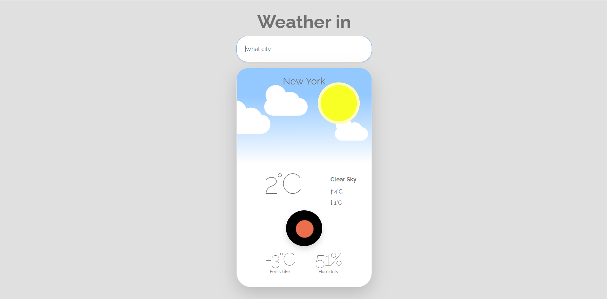
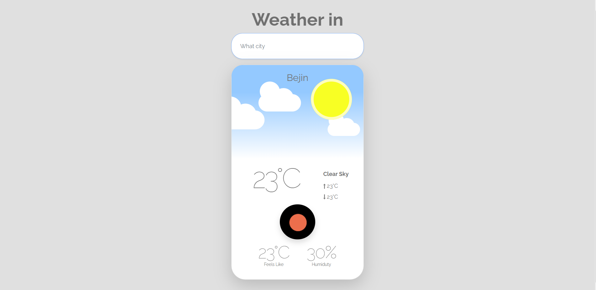
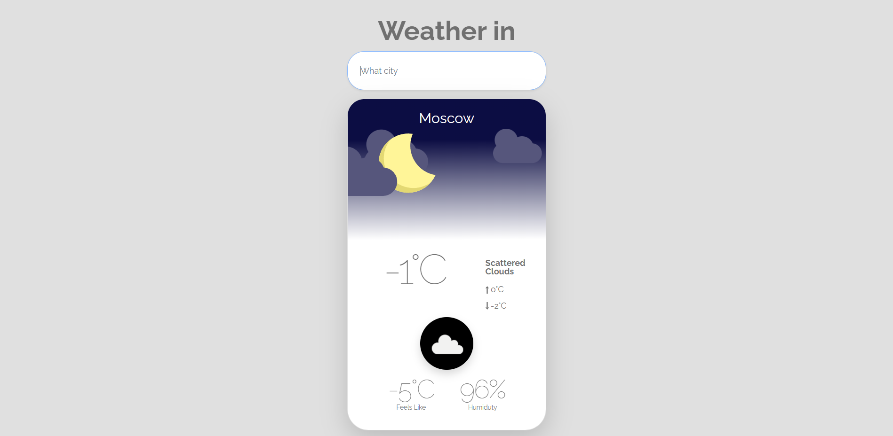

# [WeatherApp](https://mkaell.github.io/weather-app/)

### _Application functionality:_ 
This application allows you to find the weather and some other indicators (humidity, maximum and minimum temperature, precipitation description, etc.). To do this, you just need to write the city you are interested in in the input field.

### _Technologies used:_ 
- The application is written using **JS**.
-  There is an adaptation for all devices.

  
  
  
  

